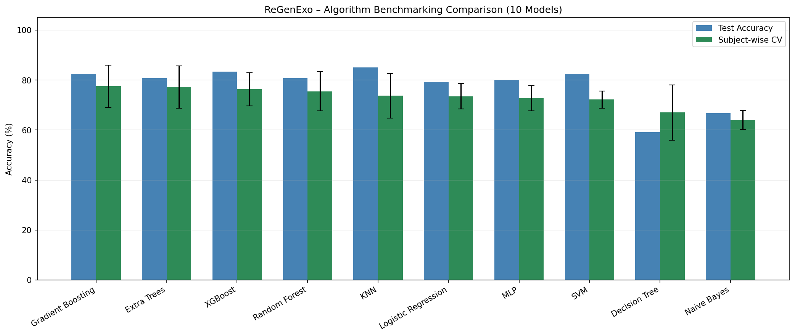
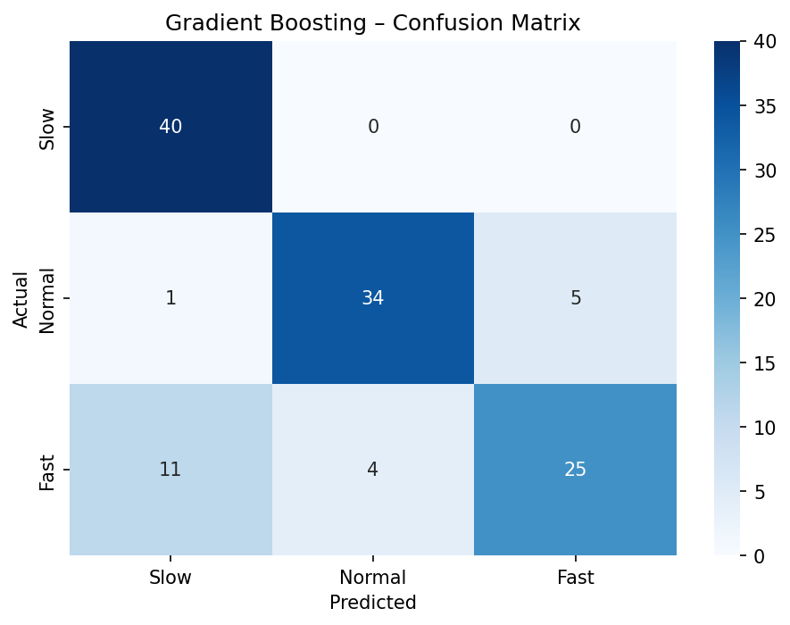
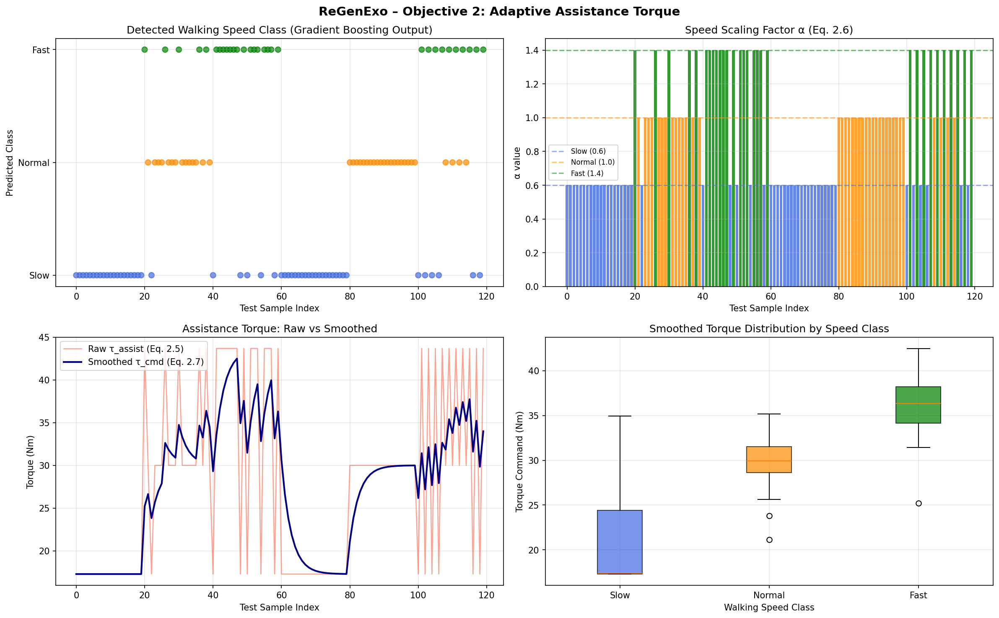

# Gait Speed Classification & Adaptive Torque Control for Lower-Limb Exoskeleton

Machine learning pipeline that classifies walking speed (Slow/Normal/Fast) from joint angle data and uses the prediction to compute adaptive exoskeleton assistance torque in real time. Built as part of the ReGenExo lower-limb exoskeleton final year project.

## Problem
For an exoskeleton to assist naturally, it must detect how fast the wearer is walking and scale its assistance accordingly. This project benchmarks 10 ML classifiers to find the best model for that detection step, then feeds the prediction into a torque controller.

## Dataset
Dataset: gait.csv (included in this repo), based on a publicly available multivariate gait dataset. Source link and full attribution to be added — pending confirmation of the exact original source and license terms.181,800 rows of joint angle time-series data from 10 subjects walking at Slow, Normal, and Fast speeds, covering Hip, Knee, and Ankle joints on both legs.

Feature-engineered into 600 trial-level samples with 33 statistical features per trial (mean, std, min, max, range, skewness, kurtosis, zero-crossings, etc.)

## Methodology
- **Subject-wise split**: 8 subjects train, 2 subjects test — no subject appears in both
- **GroupKFold (5-fold)** cross-validation for a more honest generalization estimate
- Fixed key methodological issues found during development: removed data leakage from pre-split scaling, corrected non-subject-aware splits, added Pipeline wrappers for scale-sensitive models

## Results

| Model | Test Accuracy | Subject-wise CV Mean | CV Std |
|---|---|---|---|
| **Gradient Boosting** | 82.5% | **77.5%** | 8.4% |
| Extra Trees | 80.8% | 77.2% | 8.4% |
| XGBoost | 83.3% | 76.3% | 6.6% |
| Random Forest | 80.8% | 75.5% | 7.8% |
| KNN | 85.0% | 73.7% | 8.9% |
| Logistic Regression | 79.2% | 73.5% | 5.1% |
| MLP | 80.0% | 72.7% | 5.0% |
| SVM | 82.5% | 72.2% | 3.4% |
| Decision Tree | 59.2% | 67.0% | 11.0% |
| Naive Bayes | 66.7% | 64.0% | 3.8% |

**Why subject-wise CV over raw test accuracy?** Test accuracy comes from a single split and can look misleadingly high depending on which subjects land in the test set. Subject-wise CV reflects performance on people the model has never seen — which is why KNN's high test accuracy (85.0%) is less trustworthy than its lower, more variable CV score (73.7%).

**Winning model: Gradient Boosting** — best subject-wise CV accuracy (77.5% ± 8.4%), selected dynamically in the pipeline.

## From classification to control: Adaptive Assistance Torque

The predicted walking speed feeds directly into a torque controller that scales exoskeleton assistance:

- Slow walking → α = 0.6 → ~21.0 Nm
- Normal walking → α = 1.0 → ~29.8 Nm
- Fast walking → α = 1.4 → ~36.1 Nm

An exponential smoothing filter (λ = 0.3) is applied to avoid abrupt torque changes between predictions, keeping the assistance smooth for the wearer.

## Tools
Python, scikit-learn, XGBoost, pandas, NumPy, Matplotlib, Google Colab

## Author
Rafia — Electronics Engineering, Mehran University of Engineering & Technology (MUET)
